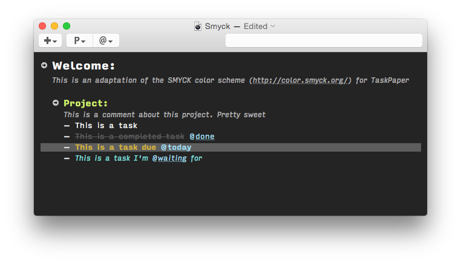

SMYCK TaskPaper Theme
=====================

This is an adaptation of the [SMYCK color scheme](http://color.smyck.org/) for [TaskPaper](http://www.hogbaysoftware.com/products/taskpaper).

Font
----
The theme is using the Input coding fonts from Font Bureau. It's available free of charge for private/unpublished use [here](http://input.fontbureau.com/download/).